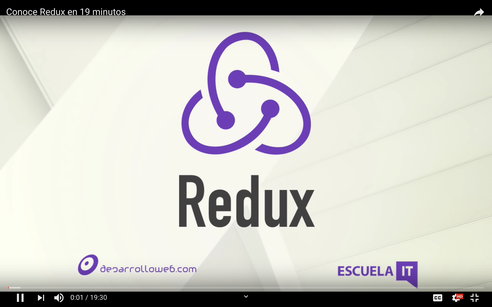

# FullStack Batch #8

## Al entrar
  - Desarrollador con 1 o menos años de experiencia trabajando en maquetación HTML/CSS y programación JavaScript
- Conocimientos básicos o nulos de control de versiones git.
- Profesionista de otra área que tiene interés de aprender a programar.

## Al salir

- Controlar la terminal o consola de S.O. para manejo de ficheros y directorios.
- Maquetar y diseñar páginas web estáticas y dinámicas con HTML5, CSS3, ES6 y React.
- Diseñar, y construir un esquema de información de base de datos MongoDB.
- Diseñar, y construir un backend API Restful con NodeJS y Express 4.
- Comunicarse y relacionarse en networkings para presentar demos y perfil técnico en entrevistas.
- Documentarse y autoformarse en algún framework basado en el dominio de conocimento adquirido.

> Un desarrollador fullstack posee las herramientas y experiencia para desarrollar aplicaciones web desde la interfaz gráfica (página web) hasta sus interacciones con la información (backend y base de datos) permitiéndole desarrollar soluciones tecnológicas en el mercado laboral en un perfil Jr.

## Módulos

### Módulo 1 - Getting Started - Semana 1 a 3
En este módulo pulimos tus conocimientos de cómo usas tu equipo de cómputo y cómo funciona internet para que puedas resolver problemáticas que van más allá del lenguaje y están relacionados con la arquitectura de internet. 

### Módulo 2 - Designing API - Semana 4 a 7
Aprenderás a cómo utilizar ExpressJS para hacer una API REST, como modelar datos y hacer una implementación en manejadores como MySQL y MongoDB. Aplicar Testing a módulos y usar git para trabajo colaborativo

### Módulo 3 - Building Client - Semana 8
Aprenderás a usar React para construir aplicaciones, aprenderás a hacer SPA, arquitectura de componentes y testing usando jest + enzyme

### Módulo 3 - Design Software & Paradigms - Semana 9
Aprenderás a usar patrones de diseño, SOLID y paradigmas de programación para brindar mejores soluciones, refactorizando código y hacerlo más mantenible

### Módulo 4 - Redux - Semana 10
Aprenderás a usar Redux y conectarlo con React para crear aplicaciones más robustas separando el estado de la aplicación de la lógica de programación

### Módulo 5 - Ending - Semana 11 y 12
Aprenderás algunas herramientas como firebase, conceptos de algoritmia y resolución de problemas además de soft-skills que te ayudarán a ser un mejor profesional: tracking de tiempo y public speaking

## Instructores

 - [GDL] 
 - [CDMX]

License
----

MIT
