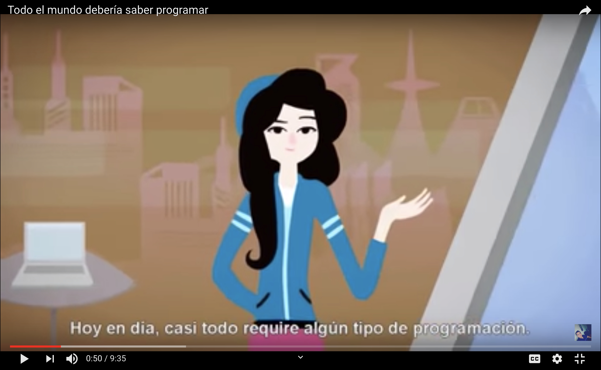
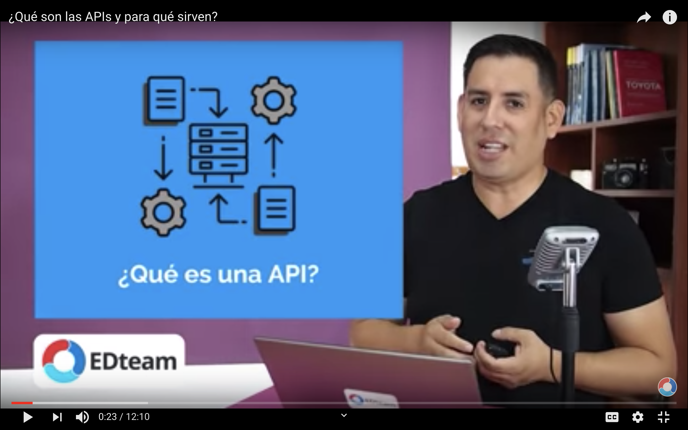
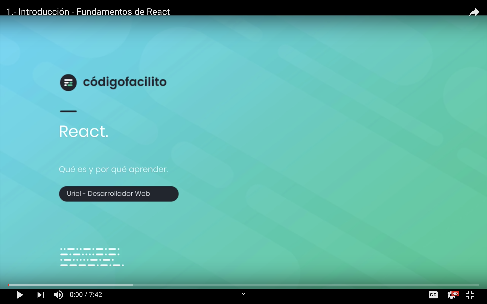
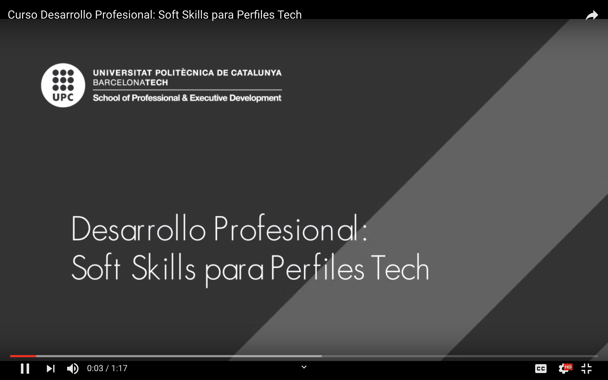
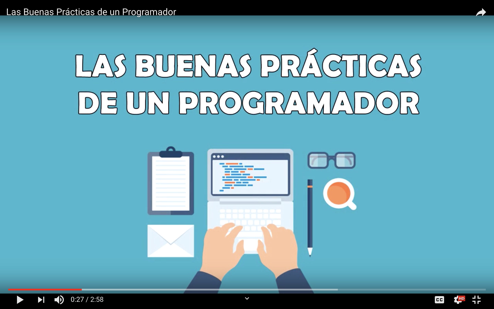

# FullStack Batch #8

### ¿Qué sigue?

Con este material encontrarás tu curso dividido en módulos y semanas, te recomendamos revisar los vídeos un par de días antes de esa clase para que tengas mejor visualización del tipo de contenido y temas que aprenderás.

## Al entrar
  - Desarrollador con 1 o menos años de experiencia trabajando en maquetación HTML/CSS y programación JavaScript
- Conocimientos básicos o nulos de control de versiones git.
- Profesionista de otra área que tiene interés de aprender a programar.

## Al salir

- Controlar la terminal o consola de S.O. para manejo de ficheros y directorios.
- Maquetar y diseñar páginas web estáticas y dinámicas con HTML5, CSS3, ES6 y React.
- Diseñar, y construir un esquema de información de base de datos MongoDB.
- Diseñar, y construir un backend API Restful con NodeJS y Express 4.
- Comunicarse y relacionarse en networkings para presentar demos y perfil técnico en entrevistas.
- Documentarse y autoformarse en algún framework basado en el dominio de conocimento adquirido.

> Un desarrollador fullstack posee las herramientas y experiencia para desarrollar aplicaciones web desde la interfaz gráfica (página web) hasta sus interacciones con la información (backend y base de datos) permitiéndole desarrollar soluciones tecnológicas en el mercado laboral en un perfil Jr.

## Módulos

### Módulo 0: Regularización (3 semanas)
* Semana 1: Conceptos básicos de internet, Git
* Semana 2: HTML y CSS básico
* Semana 3: Lógica y Pseudocódigo, javascript básicos

###	Módulo 1: Computer Science (1 semana)

* Semana 4: Semana entera de ejercicios de JS

### Módulo 2: Frontend web
* Semana 5: Javascript avanzado, DOM
* Semana 6: OPP y Asincronía (promesas)
* Semana 7: CSS y HTML avanzado, Bootstrap / Materialize

### Módulo 3: Backend web
* Semana 8: Node JS, Servers
* Semana 9: Express y REST

	
### Módulo 4: Bases de datos
* Semana 10: MySQL
* Semana 11: MongoDB

### Módulo 5: React
* Semana 12: Babel y webpack, React básico
* Semana 13: React intermedio

### Módulo 6: Final
* Semana 14: Firebase
* Semana 15: Deployment y Proyecto
* Semana 16: Proyecto

## Instructores

 - [GDL] 
 - [CDMX]

License
----

MIT
